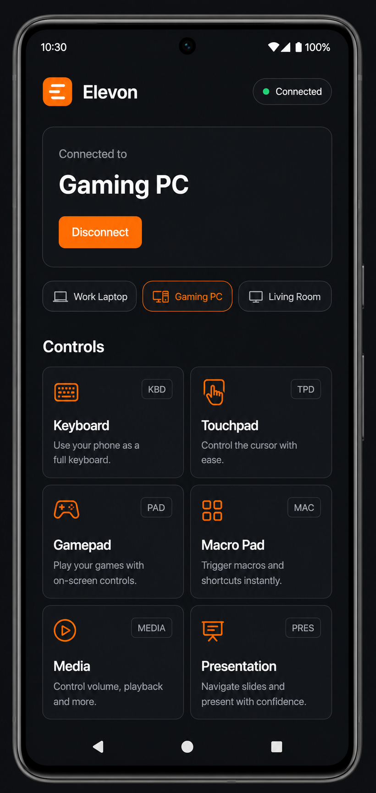
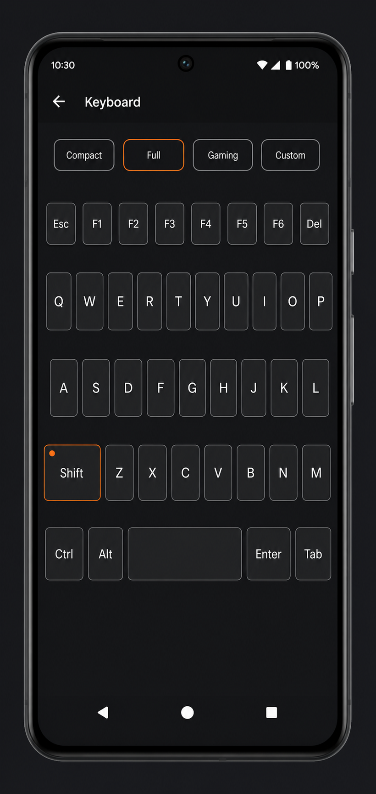
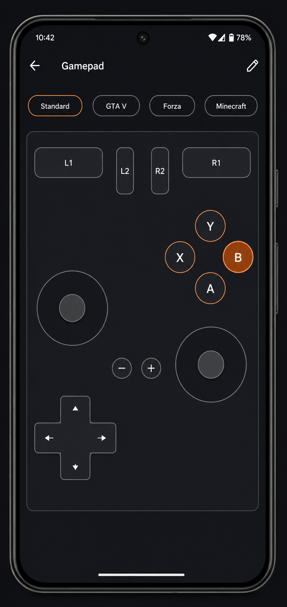
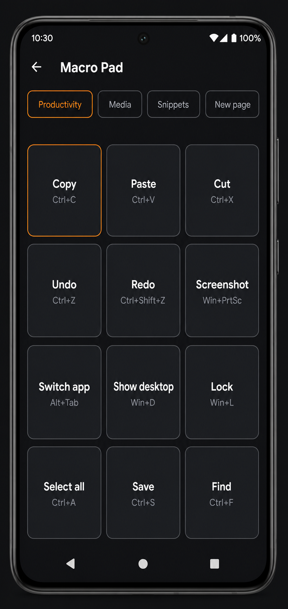
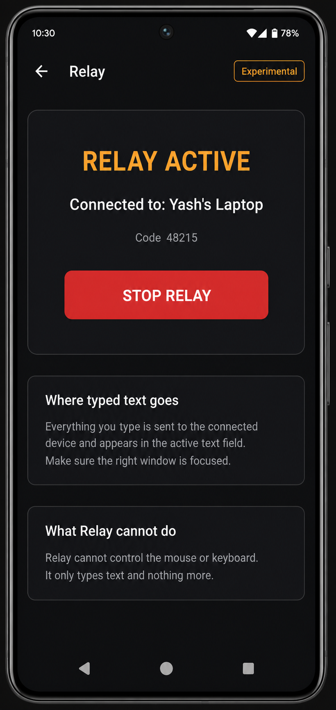

<div align="center">


# Elevon

**Your phone. Your controls.**

One pairing. Every control. **Nothing to install on your computer.**

[](https://github.com/MeYashverma/NEXUS/actions/workflows/build.yml)
[](https://github.com/MeYashverma/NEXUS/releases)
[](LICENSE)
[](https://developer.android.com)
[](docs/research.md#platform-capabilities-and-hard-limits)

**[Website](https://meyashverma.github.io/NEXUS/)** ·
**[Download](https://github.com/MeYashverma/NEXUS/releases)** ·
**[Features](https://meyashverma.github.io/NEXUS/features.html)** ·
**[Elevon Relay](https://meyashverma.github.io/NEXUS/relay/)** ·
**[Research](docs/research.md)**



</div>

---

## What is Elevon?

Elevon turns an Android phone into a **real wireless input device** for any computer —
keyboard, touchpad, gamepad, macro deck, media remote and presentation clicker, all over a
**single Bluetooth pairing**, like a proper peripheral.

Your computer sees a standard Bluetooth keyboard + mouse + gamepad. That's the whole trick:
**no desktop app, no server, no driver, no tray icon, no account** — and no "installer" sneaking
in later. It's a product principle with its own documentation:
[the no-host-software principle](docs/research.md#what-elevon-can-do-differently).

| | |
|---|---|
| ⌨️ **Keyboard** | Compact, full, gaming and custom layouts. Sticky/locked modifiers, F-keys, auto-repeat, host keyboard layouts. |
| ☝️ **Touchpad** | Move, tap-to-click, two-finger scroll, right-click, press-and-hold drag — tunable speeds and haptics. |
| 🎮 **Gamepad** | Editable layouts, dead zones, triggers, per-game profiles — plus a keyboard+mouse output mode that works in *every* game. |
| ▦ **Macro Pad & Custom** | Pages of big one-tap actions and build-your-own decks. No desktop server, unlike Stream Deck Mobile. |
| ▶ **Media / 🖥 Presentation** | Couch-ready remotes with big targets; presentation mode with timer, blank and three advance-key styles. |
| 👤 **Profiles** | Per-computer and per-situation bundles: mode, layouts, gamepad profile, deck, OS-aware shortcuts. |
| 📋 **Clipboard bridge** | Send text either way — typed out over HID, or received via Relay. Local history you can wipe. |
| 🧪 **Elevon Labs** | Home of experiments: **Relay** — type from your laptop keyboard onto your phone, from the browser, end-to-end encrypted. |

> **Why "Elevon"?** An elevon is the aircraft control surface that does the job of two
> (elevator + aileron). One surface, many jobs — exactly what this app makes of your phone.
> The working name *NEXUS* was replaced after [naming research](docs/research.md#naming-research).

## Quick start

1. **Install** — grab the latest APK from [Releases](https://github.com/MeYashverma/NEXUS/releases)
   (signed, with SHA-256 checksums). Android 9+.
2. **Pair** — open Elevon, then on your computer: *Bluetooth settings → add device → your phone*.
   Accept the prompt. Your computer now has a new keyboard, mouse and gamepad. That's the whole setup.
3. **Connect** — back in Elevon, tap your computer and pick a mode. Switch modes any time — no re-pairing.

Full guide with screenshots: **[Getting started](https://meyashverma.github.io/NEXUS/getting-started.html)**.

<div align="center">
<table><tr>
<td></td>
<td></td>
<td></td>
<td></td>
</tr></table>
<p><sub>Keyboard · Gamepad · Macro Pad · Relay (Labs). More on the <a href="https://meyashverma.github.io/NEXUS/features.html">features page</a>.</sub></p>
</div>

## Compatibility, honestly

| | Keyboard / touchpad / decks | Gamepad |
|---|---|---|
| **Windows 10/11** | ✅ | ◐ DirectInput/Raw Input + Steam Input; XInput-only games need Steam |
| **macOS** | ✅ | ◐ Generic-HID apps (Steam, emulators, browsers) only |
| **Linux / SteamOS** | ✅ | ✅ |
| **iPadOS** | ✅ (pointer 13.4+) | ❌ |
| **Android TV** | ✅ | ✅ mostly |
| **Consoles** | ❌ | ❌ |

- **Your phone needs Android 9+** with the Bluetooth HID Device profile. Most phones have it;
  some makers disable it — Elevon **detects this at first run and tells you plainly** instead of
  failing silently.
- The gamepad **cannot impersonate an Xbox controller** (Android doesn't expose vendor/product IDs).
  That's why keyboard+mouse output mode exists, and why the docs say "Steam Input" where it's true.
- Full tables and the reason behind every limit:
  **[Compatibility](https://meyashverma.github.io/NEXUS/compatibility.html)** ·
  **[Research](docs/research.md#platform-capabilities-and-hard-limits)**.

## Elevon Relay (experimental)

> **Use the keyboard already in front of you to type on your phone.**

The reverse direction, as a Labs experiment: your laptop's browser connects to the phone over
Bluetooth, end-to-end encrypted (ECDH P-256 + AES-GCM) with a 5-digit comparison code.
Nothing is installed on the laptop — the browser is the client. And it's honest about scope:
a web page only sees keys typed into its own focused box, Relay pauses when you switch tabs,
and **no website can capture a system-wide keyboard** — Relay says so instead of pretending.

**[Try Relay →](https://meyashverma.github.io/NEXUS/relay/)**

## Privacy by capability

Elevon's manifest has **no INTERNET permission**. The OS *physically prevents* the app from
sending data anywhere — privacy that's verifiable, not promised. No account, no analytics,
no crash reporting. Devices, profiles, layouts and clipboard history live on your phone.
Details: [Privacy](https://meyashverma.github.io/NEXUS/privacy.html) ·
[manifest](app/app/src/main/AndroidManifest.xml).

## Repository layout

```
├── app/                 Android app (Kotlin, Compose; AGP 8.13 / Gradle 8.14.3)
│   └── app/src/main/java/app/elevon/
│       ├── hid/         Bluetooth HID device layer + reports + descriptors
│       ├── relay/       Relay GATT server, E2E crypto, Relay keyboard (IME)
│       ├── input/       Layouts, gamepad profiles, macros, OS-aware shortcuts
│       ├── data/        Settings, devices, profiles (local JSON, no network)
│       └── ui/          Compose UI: all screens and theme
├── website/             GitHub Pages site (committed output; generator in tools/)
├── tools/               Website generator (python3 tools/build_site.py)
├── branding/            Logo, social preview
├── docs/                research.md · design.md (+ guides below)
└── .github/             CI (build + signed APK artifacts), templates, funding
```

## Documentation

| Doc | Contents |
|---|---|
| [docs/research.md](docs/research.md) | Competitive research: Unified Remote, Monect, KDE Connect, Bluke, Pocket-Pad, Linkpad, GhostBoard and more — what to learn, avoid, and do differently; platform limits; naming study |
| [docs/design.md](docs/design.md) | Design system: tokens, type, motion, accessibility, writing rules |
| [docs/getting-started.md](docs/getting-started.md) | Setup walkthrough and connection guide |
| [docs/compatibility.md](docs/compatibility.md) | Supported phones/hosts, gamepad limits, Relay browsers, FAQ |
| [docs/troubleshooting.md](docs/troubleshooting.md) | Practical fixes for connection, input feel, Relay |
| [docs/privacy.md](docs/privacy.md) | Data: what's stored, what crosses the air, how to delete |
| [docs/releasing.md](docs/releasing.md) | Versioning, signing, release checklist |
| [docs/roadmap.md](docs/roadmap.md) | Completed / in progress / planned / experimental |
| [docs/changelog.md](docs/changelog.md) | Release notes |

## Building from source

```bash
git clone https://github.com/MeYashverma/NEXUS.git
cd NEXUS/app
./gradlew assembleDebug     # debug APK → app/app/build/outputs/apk/debug/
./gradlew testDebugUnitTest # unit tests (HID, crypto, models)
```

Requirements: JDK 17, Android SDK 36 (Android Studio handles it). Release builds are signed with
the debug key by default so anyone can run them — see [docs/releasing.md](docs/releasing.md) for
production signing. CI builds and uploads APK artifacts on every push.

## Contributing

Issues, PRs, real-device test reports and new game profiles are all welcome — read
[CONTRIBUTING.md](CONTRIBUTING.md) for ground rules (no host software for core features, no new
permissions without justification, no telemetry ever). Security issues: see
[SECURITY.md](SECURITY.md) — please don't open public issues for them.

## License

[Apache-2.0](LICENSE). Research document and design system are part of the project;
brand assets live in [branding/](branding/).

<div align="center">
<sub>Your phone is more than a phone. It can be the missing input device for everything around you.</sub>
</div>
