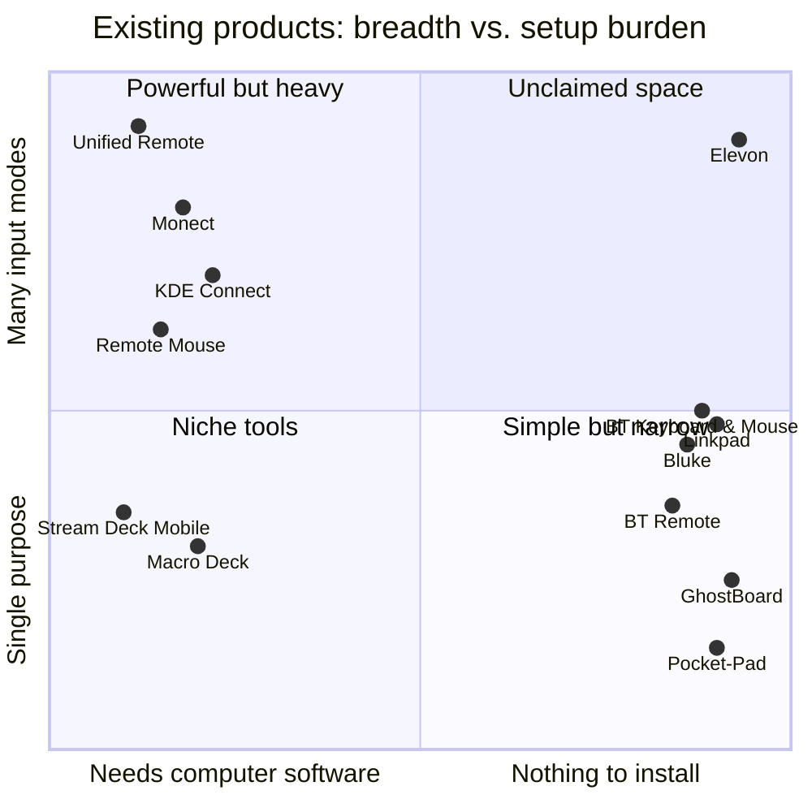

# Research report

> Research date: **24 September 2026**. Research came before any product code. Every major product decision in Elevon points back to a finding here (see [How the research shaped Elevon](#how-the-research-shaped-elevon)).

## Contents

1. [Summary](#summary)
2. [Method](#method)
3. [The landscape at a glance](#the-landscape-at-a-glance)
4. [Comparison table](#comparison-table)
5. [What users complain about](#what-users-complain-about)
6. [Platform capabilities and hard limits](#platform-capabilities-and-hard-limits)
7. [What already exists](#what-already-exists)
8. [What Elevon should learn from](#what-elevon-should-learn-from)
9. [What Elevon should avoid](#what-elevon-should-avoid)
10. [What Elevon can do differently](#what-elevon-can-do-differently)
11. [How the research shaped Elevon](#how-the-research-shaped-elevon)
12. [Naming research](#naming-research)
13. [Sources](#sources)

---

## Summary

- **Two kinds of product exist, and each has a gap.**
  - *Remote apps with host software* (Unified Remote, Remote Mouse, Monect, KDE Connect, Stream Deck Mobile, Macro Deck, Deckboard, Touch Portal, Mousedroid) are powerful. But they need a server, driver or companion app on the computer. Users report server restarts, firewall setup, IP changes, missing DLLs and paywalls.
  - *Serverless Bluetooth HID apps* (Bluetooth Keyboard & Mouse, Bluetouch, BT Remote, Kontroller, Bluke, Pocket-Pad, Linkpad, GhostBoard) need nothing on the computer. But almost all of them do one or two jobs: keyboard + mouse, *or* a gamepad. Several are paywalled, ad-supported, closed source or abandoned.
- **Nobody combines every mode on a single pairing, for free, in the open, without host software.** Keyboard, touchpad, gamepad, macro decks, media, presentation, per-computer profiles and game profiles is the unclaimed space.
- **Android makes this possible without root, with two big caveats.**
  - The `BluetoothHidDevice` API (Android 9+) lets a phone act as a real Bluetooth keyboard, mouse or gamepad.
  - Some manufacturers ship phones with the profile disabled (LG, older OnePlus, Motorola, Nokia, Fairphone 6 reported). An app must detect this and say so honestly.
  - The phone cannot choose its USB vendor or product ID. So it can never impersonate an Xbox controller, and XInput-only games need Steam Input.
- **The reverse direction (laptop keyboard → phone) can be built without installing anything, but only inside a browser tab.**
  - Web Bluetooth ships in Chrome/Edge on Windows, macOS, ChromeOS and Android. On Linux it needs a flag. Firefox and Safari don't have it.
  - A web page only receives keys while it is focused. Keyboard Lock only works in fullscreen. System-wide capture is impossible and must never be claimed.
- **Trust is a feature.**
  - Issue trackers are full of "why does it need location?", "Play Protect blocked it", "potential malware" (closed-source APKs) and "my phone isn't supported and nothing happens".
  - An app with no internet permission, a clear compatibility checker, signed releases and plain-language limits stands out.

## Method

| Step | What we did |
| --- | --- |
| Product review | Read store listings, official sites and READMEs for 25+ apps and projects: host-software remotes, serverless HID apps, stream-deck apps, root/USB-gadget tools and reverse-direction tools. |
| Issue mining | Read the full issue lists of Bluke, Kontroller, Pocket-Pad, Mousedroid, SmartMouse and BlueHID to find real user pain. Where needed we read individual issue threads (for example Bluke #11 and Kontroller #7). |
| Platform research | Android `BluetoothHidDevice` behaviour and OEM support; Windows XInput vs DirectInput; Apple GameController limits; Web Bluetooth implementation status; Keyboard Lock API; Android IME model. |
| Build research | Checked current, maintained Google samples (Now in Android, compose-samples) to choose a toolchain that exists and is supported today. |
| Name research | GitHub repository search, web search and app-store results for "Nexus" and about 30 alternative names. |

We could not find a product called **"Cordless"** that matches the brief (phone as computer input). Searches only returned generic "cordless" results and unrelated Remote Mouse / WiFi Mouse listings. We left it out rather than guess. **"MobileDeck"** turned out to be a handful of small hobby projects (a Python-server macro pad and an Android deck with an optional PC companion), so we reviewed the stream-deck category as a whole.

## The landscape at a glance

Elevon's position on this chart is the *goal*: every mode on one pairing, with no computer software. The rest of this report explains how we get there honestly, and where we can't.

## Comparison table

✅ = yes · ◐ = partial or limited · ❌ = no · 💲 = paid tier or subscription · 🖥 = needs software on the computer

| Product | Phone keyboard | Mouse | Touchpad | Gamepad | Macros | Profiles | Customisation | Computer software | Browser-based | Open source | Docs quality | UX notes | Unique features |
| --- | :-: | :-: | :-: | :-: | :-: | :-: | :-: | :-: | :-: | :-: | :-: | --- | --- |
| **Unified Remote** | ✅ | ✅ | ✅ | ◐ | ✅ 💲 | ◐ | ✅ 💲 (Lua/XML remotes) | 🖥 server (Win/Mac/Linux) | ❌ | ❌ | Good | 90+ remotes, but "Go Pro" pop-ups, server restarts and reconnection issues | Floating remotes, widgets, Wake-on-LAN |
| **Remote Mouse** | ✅ | ✅ | ✅ | ❌ | ◐ | ❌ | ◐ | 🖥 server | ❌ | ❌ | Basic | Polished; paid features | Gyro mouse, Magic Trackpad style, left-handed mode |
| **Monect PC Remote** | ✅ | ✅ | ✅ | ✅ (Xbox via PC driver) | ✅ | ◐ | ✅ (layouts, scripting) | 🖥 host + driver | ❌ | ❌ | Fair | Powerful but setup-heavy | Gyro aim, tilt steering, screen share |
| **KDE Connect** | ✅ | ✅ | ✅ | ❌ | ◐ (run commands) | ❌ | ◐ | 🖥 desktop app (Linux; Windows via Store; macOS nightly) | ❌ | ✅ GPL | Good | Broad integration; not an input-first design | Clipboard sync, files, presentation laser, encryption |
| **Stream Deck Mobile** | ❌ | ❌ | ❌ | ❌ | ✅ | ✅ | ✅ | 🖥 Stream Deck app | ❌ | ❌ | Good | Premium feel; 6 free keys, 64 with subscription 💲 | Big plugin ecosystem |
| **Macro Deck / Deckboard / Touch Portal** | ❌ | ❌ | ❌ | ❌ | ✅ | ✅ | ✅ | 🖥 desktop server | Macro Deck has a web client | Macro Deck ✅ | Fair | Screen timeout and burn-in complaints | Plugins, OBS integration |
| **Bluetooth Keyboard & Mouse** (Appground) | ✅ | ✅ | ✅ | ❌ | ◐ | ❌ | ◐ 💲 custom controls | ✅ none | ❌ | ❌ | Good | Freemium with ads | 32 keyboard layouts, air mouse, speech input, jiggler |
| **Bluetouch** | ✅ | ✅ | ✅ | ❌ | ❌ | ❌ | ◐ | ✅ none | ❌ | ❌ | Basic | Ads | Barcode → typed text |
| **BT Remote** (jqssun / Atharok) | ✅ | ✅ | ✅ | ❌ | ❌ | ❌ | ◐ | ✅ none | ❌ | ✅ GPL-3.0 | Basic | Clean, minimal | Wide host list, reproducible builds |
| **Kontroller** | ✅ | ✅ | ✅ | ❌ | ❌ | ❌ | ❌ | ✅ none | ❌ | ✅ Apache-2.0 | Basic | Crashes on Android 11/12, asks for location; inactive since 2025 | Early open-source HID pioneer |
| **Bluke** | ✅ | ◐ | ✅ | ✅ | ❌ | ❌ | ◐ (themes) | ✅ none | ❌ | ✅ AGPL-3.0 | Basic | Fun keyboard look | Mechanical switch sounds, Material You |
| **Pocket-Pad** (jobrobse) | ❌ | ❌ | ❌ | ✅ | ❌ | ❌ | ◐ | ✅ none | ❌ | ❌ (APK only) | Good README | Focused; trust issues (Play Protect, "malware?" issue) | Hair triggers, per-stick dead zones, OLED dimming |
| **Linkpad** | ✅ | ✅ | ✅ | ❌ | ❌ | ✅ per host | ◐ | ✅ none | ❌ | ✅ MIT | Good | Neon glassmorphism theme | Air mouse, TV remote tab, Quick Settings tile |
| **GhostBoard** | ✅ | ✅ | ✅ | ❌ | ❌ | ❌ | ❌ | ✅ none | ❌ | ✅ MIT | Basic | Simple split view | Idle "wake-up pulse" against Bluetooth sniff lag |
| **USB Keyboard** (pelya) / **USB Gadget Tool** (tejado) | ✅ | ✅ | ◐ | ◐ | ❌ | ❌ | ❌ | ✅ none (USB cable) | ❌ | ✅ | Technical | **Needs root / custom kernel** | Works in BIOS and bootloaders |
| **WiFi Keyboard** (reverse direction) | — | — | — | — | — | — | — | Browser on the computer; server on the phone | ✅ | ✅ GPL-2.0 | Basic | Inactive since 2020; plain HTTP | Type on the phone from a PC browser |
| **Typeeto** (reverse direction) | — | — | — | — | — | — | — | 🖥 Mac app | ❌ | ❌ | Good | Paid Mac app | Mac keyboard → iPhone, iPad, Apple TV |
| **Elevon** (this project) | ✅ | ✅ | ✅ | ✅ | ✅ | ✅ | ✅ progressive | ✅ **none for core** | ✅ Relay (Labs) | ✅ Apache-2.0 | Full docs + website | One pairing, every mode | Game profiles with keyboard/mouse mapping, macro decks without host app, encrypted browser Relay |

## What users complain about

Collected from public issue trackers and reviews. These are the problems Elevon must not repeat.

| Pain point | Evidence | Elevon response |
| --- | --- | --- |
| "Nothing happens when I press Connect" on phones without HID support | Bluke #11 (LG V50); Kontroller #7 (Lenovo); Fairphone 6 forum thread | A **compatibility check** runs on first launch and explains in plain words if the phone can't act as a Bluetooth input device. The UI never shows a silent button. |
| Needs location permission | Kontroller #6 "Why location permission?" | Android 12+: `BLUETOOTH_SCAN` with `neverForLocation`. Android 9–11: no phone-side scanning at all. Pairing is started from the computer. **Elevon never asks for location.** |
| Keyboard layout wrong (AZERTY, German, French, Spanish) | Bluke #4; Mousedroid #45, #23, #6, #32 | A **host keyboard layout** setting per profile, so typed text matches the computer's language setting. |
| Scroll too fast, no sensitivity control | Kontroller #1; Bluke #19/#20 | Separate pointer speed, acceleration and scroll speed, plus natural scrolling. |
| Double-tap-to-drag, modifiers while using the touchpad | Bluke #18, #19 | Tap-and-hold drag, drag lock, and a modifier strip on the touchpad. |
| Custom layouts wanted | Bluke #17; Kontroller #15 | Custom keyboard rows, a gamepad layout editor, and macro and control-surface editors. |
| Gamepad D-pad bug (two directions sent the same input) | Bluke #16 | Hat-switch encoding is unit-tested for all 8 directions. |
| Gamepad buttons mapped wrongly on the host | Pocket-Pad #5 | Button order follows the Linux/SDL generic-gamepad conventions and is documented. There is an on-host test guide. |
| Host shows a confusing name | Bluke #9 | Explain that computers show the phone's Bluetooth name. The app offers a rename shortcut, with a clear warning. |
| Audio gets routed to the computer after connecting | Bluke #7 | Troubleshooting entry: the computer may also connect the phone's audio profiles. Here is how to turn that off on the computer. |
| Keyboard mirrored in right-to-left languages | Bluke #27 | Key layouts force left-to-right; labels stay localisable. |
| Screen sleeps mid-use; OLED burn-in; deck jumps back to page one after waking | Stream Deck / Deckboard reviews | Keep-screen-on in control modes, dimming after inactivity, subtle pixel shift, and the last page remembered. |
| Closed-source APK flagged by Play Protect or suspected malware | Pocket-Pad #3, #8, #2 | Open source, signed release APKs, SHA-256 checksums, and **no internet permission**. |
| Crashes from hidden APIs on newer Android | Kontroller #10, #20, #26 | Public APIs only; min SDK 28; tested against the Android 12+ permission model. |
| Host software breaks: missing DLLs, ADB paths, firewalls, driver crashes | Mousedroid #9, #12, #40, #44; Unified Remote review mentioning a driver BSOD | Core features need nothing on the computer. |
| Paywalls for the full keyboard or custom controls | Appground Pro tier; Stream Deck subscription | Everything is free and open source. |

## Platform capabilities and hard limits

### Android as a Bluetooth input device

| Topic | Finding | Consequence |
| --- | --- | --- |
| API | `BluetoothHidDevice` has been public since Android 9 (API 28). The app registers an SDP record with an HID report descriptor, then sends reports. | `minSdk 28`. No root. |
| OEM support | Pixel supports it. LG, older OnePlus, Motorola, Nokia and Fairphone 6 have shipped with the profile disabled. `onServiceConnected` may never fire, or `registerApp` fails. | Detect it with a timeout and show an honest "not supported on this phone" state. List known behaviour in the compatibility doc. |
| One app at a time | Only one HID Device app can be registered system-wide. | Friendly error: "Another app is using Bluetooth input mode." |
| Descriptor caching | Computers cache the HID descriptor at pairing time. Changing the descriptor means pairing again. | **One composite descriptor** (keyboard + mouse + media + gamepad + system) so users pair once and every mode works. A "keyboard & mouse only" compatibility descriptor is offered for fussy hosts, with a clear re-pair notice. |
| Boot protocol | BIOS and some TVs switch devices to boot protocol. | Keyboard report ID 1 and mouse report ID 2 use boot-compatible layouts. |
| Vendor/product ID | Owned by the phone's Bluetooth stack; apps can't set them. | **No Xbox/XInput impersonation is possible.** The gamepad is a generic HID gamepad. |
| Sniff mode | Bluetooth links drop into low-power sniff mode when idle. The first input after a pause can lag (GhostBoard noticed this too). | Warm up the link with an empty report as soon as a finger touches a control. |
| Permissions | Android 12+: `BLUETOOTH_CONNECT`, `BLUETOOTH_SCAN`, `BLUETOOTH_ADVERTISE`. Making the phone discoverable needs `BLUETOOTH_ADVERTISE`. | Ask only when needed and explain why. No location permission. |
| Background | Android 14+ foreground services need a type. | `connectedDevice` foreground service with a persistent notification and a Disconnect action. |
| USB | Stock Android has no public USB HID device API. | Wired USB mode is **not possible without root**. Documented as unsupported. |

### Computers as hosts

| Host | Keyboard & mouse | Media keys | Generic HID gamepad |
| --- | --- | --- | --- |
| Windows 10/11 | ✅ | ✅ | ◐ Works with DirectInput / Raw Input / Windows.Gaming.Input games and **Steam Input**. XInput-only games don't see it unless launched through Steam with generic controller support on. |
| macOS | ✅ | ✅ | ◐ Visible to apps that read generic HID gamepads (Steam, SDL games, many emulators, Chrome's Gamepad API). **Not** visible to Apple's GameController framework, which filters to known controllers. |
| Linux / SteamOS | ✅ | ✅ | ✅ `hid-generic` → evdev/joydev; SDL and Steam support it |
| ChromeOS | ✅ | ✅ | ◐ Depends on the app |
| iPadOS / iOS | ✅ keyboard; ✅ pointer on iPadOS 13.4+ | ◐ | ❌ Generic gamepads aren't supported |
| Android TV / Google TV / tablets | ✅ | ✅ | ✅ Mostly. Some Android *phones* refuse HID connections from another phone (vendor-dependent). |
| Consoles (PlayStation, Xbox, Switch) | ❌ Not tested, not claimed | ❌ | ❌ |

**Workaround for XInput-only games and games without controller support (for example Minecraft Java):** game profiles can map any on-screen control to **keyboard keys or mouse movement** instead of gamepad outputs. The computer sees a keyboard and mouse, which every game supports.

### Browsers (for Elevon Relay)

| Capability | Chrome / Edge (Windows, macOS, ChromeOS) | Chrome on Linux | Firefox | Safari |
| --- | :-: | :-: | :-: | :-: |
| Web Bluetooth (GATT client) | ✅ Windows 10 1703+ | 🚩 behind `enable-experimental-web-platform-features` | ❌ No plans | ❌ No plans |
| Keyboard Lock (fullscreen only) | ✅ Chrome 68+, Edge 79+ | ✅ | ❌ | ❌ |
| Web Crypto (ECDH, HKDF, AES-GCM) | ✅ (secure context) | ✅ | ✅ | ✅ |

Hard truths:

- A web page receives keystrokes **only while it is focused**. It can't capture keys typed into other apps. Elevon Relay will never claim system-wide capture.
- Keyboard Lock can capture OS shortcuts such as Alt+Tab only in **fullscreen**. Holding Esc always exits.
- Opera and Vivaldi desktop list Web Bluetooth as "supported but not working". Brave blocks it by default.
- A plain-HTTP page served from the phone over Wi-Fi isn't a secure context, so Web Crypto isn't available there. It would also require the Android INTERNET permission. **Decision:** Relay v1 is Bluetooth-only. A Wi-Fi fallback is on the roadmap as "under evaluation", with this trade-off spelled out.

### Android input method (the Relay receiver)

- An `InputMethodService` can insert text into any app's focused text field using `commitText` and key events. It's the only non-root, non-accessibility way to type into other apps.
- When users enable a third-party keyboard, Android shows a warning that it "may be able to collect all the text you type". Elevon explains this *before* sending users to settings, and backs it up: **no internet permission**, open source.
- `switchToPreviousInputMethod()` (API 28+) gives a one-tap way back to the user's normal keyboard.

## What already exists

- **Full-featured remotes with host software.** Unified Remote, Monect, Remote Mouse, WiFi Mouse, KDE Connect, Mousedroid.
- **Stream-deck style macro pads with host software.** Stream Deck Mobile, Macro Deck, Deckboard, Touch Portal.
- **Serverless HID keyboard/mouse apps.** Appground's Bluetooth Keyboard & Mouse (most complete; freemium), Bluetouch, BT Remote, Kontroller, Linkpad, GhostBoard, Rabit-Pro.
- **Serverless HID gamepads.** Pocket-Pad (closed source) and Bluke's gamepad tab. Several hobby projects emulate specific controllers.
- **Root-only USB HID.** pelya's USB Keyboard and tejado's USB Gadget Tool.
- **Reverse direction.** WiFi Keyboard (browser → phone, inactive since 2020), KDE Connect's remote keyboard (needs the desktop app), Typeeto (Mac app).

## What Elevon should learn from

| From | Lesson |
| --- | --- |
| Unified Remote, Monect | Breadth matters: people want *many* control types in one app, plus per-app custom remotes. |
| Stream Deck | A deck needs to feel physical: big, bold, instantly legible buttons, pages and folders, and quick editing. |
| Monect, Pocket-Pad | Gamers expect layout editing, dead zones, hair triggers, tilt steering and screen dimming. |
| KDE Connect | Presentation remotes and clipboard sharing are loved. Encrypt what crosses the air. |
| Linkpad | Per-host profiles and a Quick Settings tile make reconnection effortless. |
| GhostBoard | Handle Bluetooth sniff-mode latency explicitly. |
| Appground | Keyboard layouts for many languages and an air mouse are expected features. |
| BT Remote | Reproducible CI builds and F-Droid availability build trust. |
| Bluke | Personality and sound/haptic polish make an input app feel good. |

## What Elevon should avoid

- **Hidden or later-added host software** for core features.
- **Silent failure** on unsupported phones, and buttons that do nothing.
- **Unexplained permissions**, especially location.
- **Paywalls, ads and nagging** ("Go Pro" pop-ups).
- **Over-claiming compatibility.** No "works with every game": XInput, Apple GameController and consoles are real limits.
- **Visual noise.** Neon glassmorphism, gradients everywhere, emoji-heavy UI and cluttered grids of tiny buttons.
- **Closed-source APKs** with no checksums or signing story.
- **Abandonment signals.** Crashes on new Android versions and unanswered compatibility issues.

## What Elevon can do differently

1. **Pair once, every mode works.** One composite HID descriptor covers keyboard, touchpad, media keys, gamepad, presentation and macros on one pairing. No mode-switch re-pairing.
2. **Game profiles that work around the XInput wall.** Each on-screen control can output a gamepad input, a keyboard key or mouse movement. The GTA V, Forza, Minecraft, emulator and Steam presets are honest about which output they use and why.
3. **Macro decks and control surfaces with no desktop app.** Stream-deck-style pages drive the computer through standard keyboard shortcuts, typed snippets and OS-aware launch sequences (Win+R / Spotlight / launcher).
4. **Profiles tied to computers.** "Gaming PC" opens the gamepad with your layout. "Work Laptop" opens the touchpad with macOS shortcuts and a UK layout.
5. **OS-aware shortcuts.** Copy is Ctrl+C on Windows and ⌘C on a Mac. Screenshot, show desktop, lock and app switching adapt to the computer type.
6. **Honest compatibility built into the product.** A phone capability check, per-mode "works on" notes, and Core / Experimental / Limited labels everywhere.
7. **Elevon Relay.** The laptop keyboard types into the phone from a web page. Nothing is installed. It is end-to-end encrypted with a 6-digit comparison code. There is always a visible "RELAY ACTIVE" banner and a big STOP.
8. **Privacy you can verify.** The Android manifest has **no INTERNET permission**, so the app physically can't upload anything.
9. **Design that feels like an instrument, not a utility.** Calm graphite and paper themes, one signal-orange accent, tactile keycaps, and large targets.
10. **Docs and a website that match the product**, including a limitations page that says "no" where the answer is no.

## How the research shaped Elevon

| Finding | Decision |
| --- | --- |
| Hosts cache descriptors; re-pairing is painful | Single composite descriptor; compatibility descriptor as an explicit, explained option |
| OEMs disable the HID Device profile | First-run compatibility check and an honest unsupported state |
| No custom VID/PID, so no XInput | Generic gamepad + Steam Input guidance + keyboard/mouse output mapping in game profiles |
| Apple GameController ignores generic pads | Compatibility table marks macOS gamepad as "Limited" and iPadOS as "Not supported" |
| Web Bluetooth only in Chromium on Win/Mac/ChromeOS | Relay lives in Labs, shows a browser check first, and explains alternatives |
| Pages can't capture keys when unfocused | Relay pauses automatically when the tab loses focus and must be resumed deliberately |
| Plain HTTP isn't a secure context and needs the INTERNET permission | Wi-Fi Relay deferred and documented; app keeps zero network permissions |
| Location-permission complaints | No location permission on any Android version |
| Layout complaints | Host keyboard layout per profile |
| Deck apps: sleep, burn-in, page reset | Keep-awake, dimming, pixel shift, remember last page |
| Trust issues with APK-only apps | Apache-2.0 source, signed releases, checksums, CI builds |

## Naming research

The working name **NEXUS** was rejected:

- **Very crowded.** About 120,000 GitHub repositories contain "nexus" in their name, including GitNexus (47k★), Sonatype Nexus, Nexus Mods and Nexus zkVM.
- **Trademark-heavy.** "Sonatype Nexus" is a registered mark. Google's *Nexus* phone line makes "Nexus for Android" read like a Google product, and Google itself met trademark conflicts over the name.
- **Already used in this exact space.** There is an Android project called *elysium-nexus-control*, a Kotlin/Compose Bluetooth HID control app.
- **Hard to search.** It says nothing about input.

Candidates checked and rejected:

| Name | Conflict found |
| --- | --- |
| Taktil | Taktil Software GmbH, a Zurich Android/iOS app studio; a Bitwig controller framework |
| Tactyl | tactyl.co (AI business tool) |
| Sidestick | Thrustmaster TCA Sidestick, a game controller |
| KeyMorph | Music app on Play and the App Store; an ML framework |
| Omnipad | Web virtual-gamepad engine, a notes app, a token launcher |
| Yoke, Helm, Maestro, Manus, Kinesis, Synapse, Mantis, Deckard | Existing controller, developer-tool, peripheral or gaming brands |
| Aileron | Popular typeface, API gateway, pharma company |
| Hidra | Search results drowned by `hidraw` |

**Chosen name: Elevon.** An *elevon* is an aircraft control surface that does the job of two (elevator + aileron). One surface, many jobs, which is exactly what this app makes of a phone.

- It's short, pronounceable (EL-uh-von) and rare in software.
- The existing uses are unrelated: a real-estate community app, a small agency, a web-testing startup.
- Feature names follow naturally: **Elevon Relay**, **Elevon Labs**.

> A formal trademark search is recommended before any commercial use. The GitHub repository is still named `NEXUS`; the owner can rename it (GitHub redirects old URLs). All links in this project are relative so a rename won't break them.

## Sources

- Unified Remote: [Play listing](https://play.google.com/store/apps/details?id=com.Relmtech.Remote), [unifiedremote.com](https://www.unifiedremote.com/)
- Monect PC Remote: [monect.com](https://www.monect.com/)
- KDE Connect: [kdeconnect.kde.org](https://kdeconnect.kde.org/), [KDE/kdeconnect-android](https://github.com/KDE/kdeconnect-android)
- Remote Mouse: [App Store listing](https://apps.apple.com/us/app/remote-mouse/id385894596)
- Bluke: [arnav-kr/Bluke](https://github.com/arnav-kr/Bluke), issues [#11](https://github.com/arnav-kr/Bluke/issues/11), [#9](https://github.com/arnav-kr/Bluke/issues/9), [#16](https://github.com/arnav-kr/Bluke/issues/16)
- Pocket-Pad: [jobrobse/Pocket-Pad](https://github.com/jobrobse/Pocket-Pad), issue [#5](https://github.com/jobrobse/Pocket-Pad/issues/5)
- Kontroller: [raghavk92/Kontroller](https://github.com/raghavk92/Kontroller), issues [#6](https://github.com/raghavk92/Kontroller/issues/6), [#7](https://github.com/raghavk92/Kontroller/issues/7)
- Linkpad: [Devdas-gupta/linkpad](https://github.com/Devdas-gupta/linkpad)
- GhostBoard: [ToxicOrca/ghostboard-android-bluetooth-mouse-keyboard](https://github.com/ToxicOrca/ghostboard-android-bluetooth-mouse-keyboard)
- BT Remote: [jqssun/android-bt-remote](https://github.com/jqssun/android-bt-remote)
- BlueHID and OEM support discussion: [ralismark/bluehid#1](https://github.com/ralismark/bluehid/issues/1)
- Fairphone 6 HID Device report: [Fairphone forum](https://forum.fairphone.com/t/bluetoothhiddevice-profile-not-exposed-on-fairphone-6/132462)
- Android HID Device profile history: [XDA: Android P adds Bluetooth HID device profile](https://www.xda-developers.com/android-p-bluetooth-keyboard-mouse/), [Stack Overflow](https://stackoverflow.com/questions/53555092/how-can-i-use-the-bluetooth-hid-device-profile-in-android-pie)
- Mousedroid: [darusc/Mousedroid](https://github.com/darusc/Mousedroid) · SmartMouse: [VirtCode/SmartMouse](https://github.com/VirtCode/SmartMouse)
- USB gadget: [pelya/android-keyboard-gadget](https://github.com/pelya/android-keyboard-gadget), [tejado/android-usb-gadget](https://github.com/tejado/android-usb-gadget)
- WiFi Keyboard: [IvanVolosyuk/wifikeyboard](https://github.com/IvanVolosyuk/wifikeyboard)
- Web Bluetooth status: [WebBluetoothCG implementation status](https://github.com/WebBluetoothCG/web-bluetooth/blob/main/implementation-status.md)
- Keyboard Lock: [Chrome for Developers](https://developer.chrome.com/blog/better-full-screen-mode)
- Generic HID vs XInput: [PCGamingWiki controller glossary](https://www.pcgamingwiki.com/wiki/Glossary:Controller)
- Apple GameController and generic pads: [Apple Developer Forums thread 763679](https://developer.apple.com/forums/thread/763679)
- Toolchain references: [android/nowinandroid](https://github.com/android/nowinandroid), [android/compose-samples](https://github.com/android/compose-samples)
